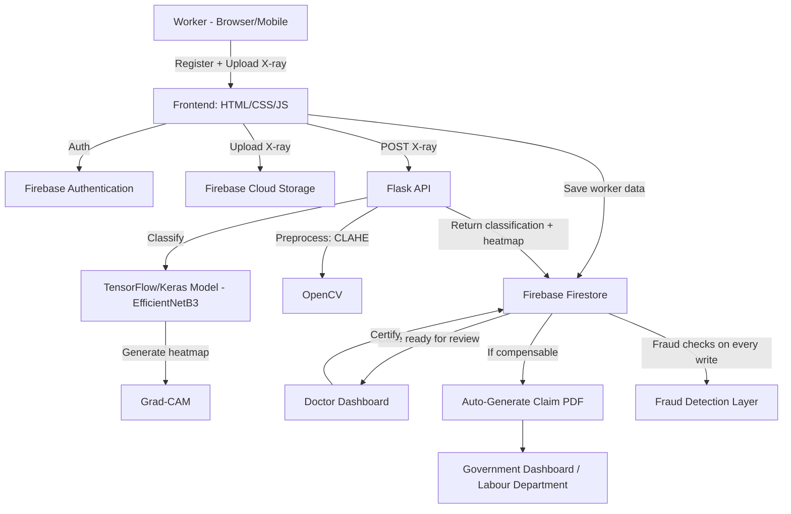
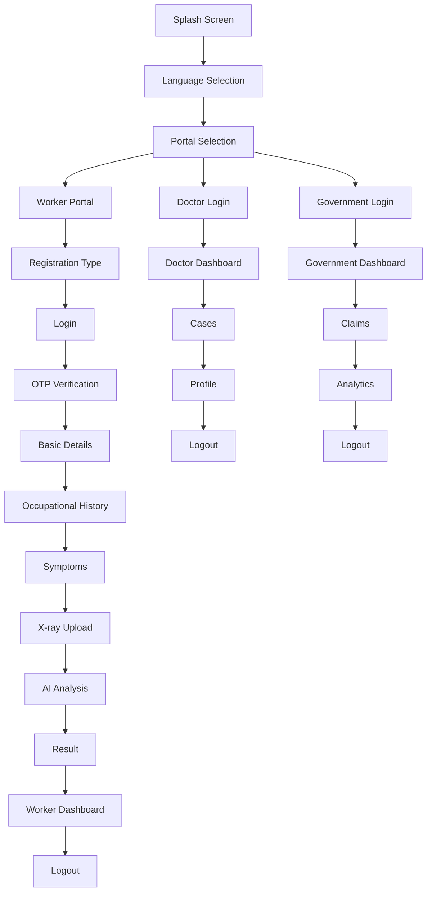
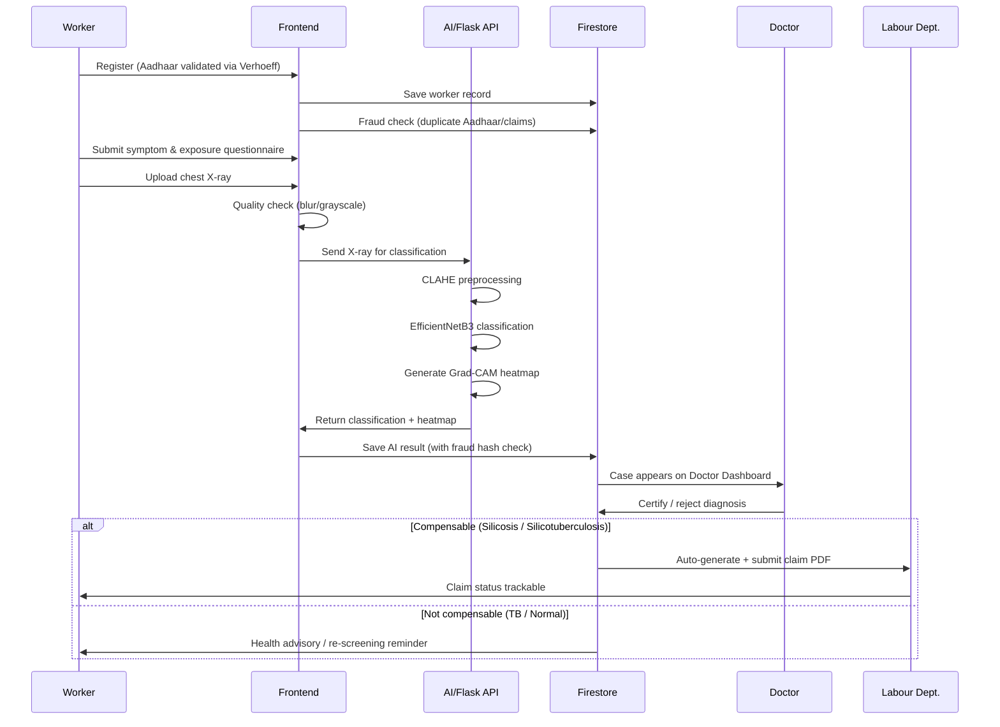

# SilicoHelp

**AI-Powered Chest X-ray Diagnosis & Automated Legal Compensation Platform for Silicosis-Affected Workers**

> Bridging the gap between medical diagnosis and legal compensation for India's informal and migrant stone/mine workers.

---

## Team Details

| Role      | Name         | Contribution                                                                   |
| --------- | ------------ | ------------------------------------------------------------------------------ |
| Team Name | LUMORA       |                                                                                |
| Person 1  | Abinaya.S    | Worker Registration & X-ray Upload Frontend                                    |
| Person 2  | Mamathy.S    | Doctor & Government Dashboards                                                 |
| Person 3  | Tamizhisai.S | Firebase Backend & Shared Data Layer                                           |
| Person 4  | Manastha.S   | AI Model Training                                                              |
| Person 5  | Suprriya.P   | X-ray Validation, Aadhaar Validation, Fraud Detection, Grad-CAM Explainability |
| Person 6  | Deepika.B    | Compensation Claims, Notifications, PDF Generation                             |

---

## Problem Statement

Silicosis is an incurable lung disease caused by inhaling fine silica dust, common among stone-cutters, quarry workers, and miners across India. Under the **Employees' Compensation Act, 1923**, affected workers are legally entitled to compensation.

In practice, almost none receive it. Claiming compensation typically requires proof of employment — something most informal and interstate migrant workers simply don't have. Even where AI-assisted diagnosis programs already exist, certified cases often still don't result in actual payment. In one documented state-run silicosis portal, **only ~1.5% of certified living patients ever received their payout.**

The gap isn't diagnosis. It's everything that happens — or doesn't happen — after diagnosis.

## Our Solution

SilicoHelp automates the full pipeline from chest X-ray to legal compensation claim:

1. Worker registers (self, or with help from an NGO/hospital field agent)
2. Completes a symptom and occupational exposure questionnaire
3. Uploads a chest X-ray
4. AI classifies the X-ray — **Normal / Silicosis / Tuberculosis / Silicotuberculosis** — with a **Grad-CAM heatmap** showing which part of the X-ray drove the decision
5. A licensed doctor reviews the AI's result and heatmap, and certifies (or rejects) it
6. The system auto-generates and submits the compensation claim
7. Worker tracks the claim's status until payout

**What makes this different:** existing tools only diagnose. Nothing else connects diagnosis directly to filing the legal claim — that connection is the core innovation.

---

## Features

### Worker Registration & Onboarding
- Language selection + voice-guided navigation (for low-literacy users)
- Dual registration mode — self-registration or NGO/hospital-assisted
- Aadhaar number validation (Verhoeff checksum algorithm)

### Health Assessment
- Symptom questionnaire (cough, breathlessness, chest pain, etc.)
- Occupational exposure score (years worked, dust exposure level, job type)

### X-ray Diagnosis Pipeline
- Chest X-ray upload
- X-ray quality validation (blur detection + grayscale check)
- AI multi-class classification (Normal / Silicosis / TB / Silicotuberculosis)
- Explainable AI (Grad-CAM heatmap)
- Automatic uncertainty check — flags results the AI itself is unsure about, for mandatory human review

### Doctor Review
- Doctor dashboard for case review
- Digital certification workflow

### Compensation & Outcome
- Outcome branching (compensation claim / health advisory / re-screening reminder)
- Auto-generated compensation claim (PDF)
- Auto-submission to Labour Department
- Claim tracking (worker view + government view)

### Security & Fraud Prevention
- Duplicate Aadhaar detection
- Multiple-claim detection
- Reused X-ray image detection (SHA-256 file hashing)

### Notifications
- SMS notifications for status updates

---

## Complete Tech Stack

| Layer              | Technology                                                                                                            |
| ------------------ | --------------------------------------------------------------------------------------------------------------------- |
| Frontend           | HTML, CSS, JavaScript, Firebase Authentication (phone OTP for workers, email/password for doctors & government staff) |
| Backend / Database | Firebase Firestore, Firebase Cloud Storage                                                                            |
| AI / ML            | Python, TensorFlow/Keras (EfficientNetB3 transfer learning), OpenCV (CLAHE preprocessing), Grad-CAM, Flask REST API   |
| Security           | Verhoeff checksum (Aadhaar validation), SHA-256 hashing (fraud detection)                                             |
| Dataset            | Silicodata — *Nature Scientific Data* (2025), IIT Jodhpur                                                             |

---

## System Architecture



---

## Detailed Workflow

### Application Screen Flow (Navigation Map)



### Backend Process Flow



---

## Folder Structure

```
SilicoHelp/
├── README.md
├── design.md
├── product-blueprint.md
├── index.html
├── assets/
│   ├── animations/
│   ├── icons/
│   ├── illustrations/
│   ├── images/
│   ├── languages/
│   └── logo/
├── css/
│   ├── style.css
│   ├── symptoms.css
│   ├── upload.css
│   ├── voice.css
│   ├── welcome.css
│   ├── worker-dashboard.css
│   └── ... (one stylesheet per page)
├── data/
│   └── states-districts.js
├── js/
│   ├── firebase-config.js         # Person 3 - Firebase backend
│   ├── data.js                    # Person 3 - shared data layer
│   ├── auth.js                    # Worker phone-OTP authentication
│   ├── staff-auth.js              # Doctor/Government email login
│   ├── aadharValidation.js        # Person 5 - Aadhaar validation (Verhoeff)
│   ├── analysis.js                # AI analysis screen logic
│   ├── analytics.js               # Government analytics
│   ├── approved-claims.js
│   ├── basic-details.js
│   ├── case.js
│   ├── claim.js
│   ├── claimTracker.js
│   ├── compensation.js
│   ├── dashboard.js
│   ├── doctor.js / doctor-cases.js / doctor-login.js / doctor-profile.js
│   ├── exposure-score.js
│   ├── govclaims.js / govdashboard.js / govlogin.js
│   ├── i18n.js / language.js / language-manager.js
│   ├── logout.js
│   ├── occupational-history.js
│   ├── otp.js
│   ├── pdf.js                     # Person 6 - PDF claim generation
│   ├── portal-selection.js
│   ├── progress.js
│   ├── registration-type.js
│   ├── result.js
│   ├── session.js
│   ├── symptoms.js
│   ├── upload.js
│   ├── voice.js
│   ├── welcome.js
│   └── worker-dashboard.js
├── locales/                       # Multi-language translation resources
├── pages/                         # All screen HTML files
│   ├── splash.html
│   ├── language.html
│   ├── portal-selection.html
│   ├── login.html / otp.html / registration-type.html
│   ├── basic-details.html
│   ├── occupational-history.html
│   ├── symptoms.html
│   ├── upload.html
│   ├── analysis.html
│   ├── result.html
│   ├── worker-dashboard.html
│   ├── doctor-login.html / docdashboard.html / doctor-cases.html / doctor-profile.html
│   ├── govlogin.html / govdashboard.html / govclaims.html / analytics.html
│   ├── approved-claims.html / claim.html / compensation.html / exposure-score.html
│   ├── voice.html / welcome.html
│   └── logout.html
├── translations/                  # Per-page text strings (multi-language support)
│   ├── common-text.js
│   ├── welcome-text.js / login-text.js / otp-text.js
│   ├── basic-details-text.js / occupational-history-text.js / symptoms-text.js
│   ├── upload-text.js / analysis-text.js / result-text.js
│   ├── doctor-login-text.js / govlogin-text.js / dashboard-text.js
│   ├── portal-text.js / registration-type-text.js / states-text.js
│   ├── dropdowns-text.js / language-text.js / voice-text.js
│   └── worker-dashboard-text.js
├── ai_service/                    # Person 5 - AI classification API
│   ├── app.py
│   ├── gradcam.py
│   ├── xray_classifier.keras
│   └── requirements.txt
├── validation/                    # Person 5 - Fraud detection
│   └── fraudCheck.js
└── person6_claims/                 # Person 6 - Claims, notifications, PDF generation
```

*(Note: this reflects Person 1's actual real project structure, including full multi-language support via `translations/` and `locales/` — a genuinely more complete implementation than earlier drafts of this README assumed.)*

---

## Installation and Usage Guide

### Prerequisites
- Node.js (for frontend/local server)
- Python 3.10+ (for the AI service)
- A Firebase project (Firestore + Authentication enabled)

### 1. Clone the repository
```bash
git clone <https://github.com/Abinaya6256/silicohelp>
cd SilicoHelp
```

### 2. Set up the Firebase backend
Place your Firebase project config in `js/firebase-config.js`.

### 3. Set up the AI service
```bash
cd ai_service
pip install -r requirements.txt
python app.py
```
The AI service will start running and be ready to accept requests from the frontend.

### 4. Run the frontend
```bash
python -m http.server
```
Run this from the project root (where `index.html` is located). This will serve the frontend locally in your browser.

> **Note:** Since the frontend uses ES modules (`import`/`export`), it must be served through a local server — opening the HTML file directly will not work.

---

## API / Database Documentation

### `/classify` (POST)
Accepts a chest X-ray image, returns AI classification results.

**Request:** `multipart/form-data`, field name `xray`

**Response:**
```json
{
  "className": "silicosis",
  "allScores": {
    "silicosis": ...,
    "silicotuberculosis": ...,
    "tuberculosis": ...,
    "normal": ...
  },
  "heatmapImageBase64": "data:image/jpeg;base64,...",
  "isConfident": true,
  "warningMessage": null
}
```

### Firestore Collections
| Collection        | Purpose                                                 |
| ----------------- | ------------------------------------------------------- |
| `workers`         | Worker registration records                             |
| `xrayCases`       | X-ray uploads + AI classification results               |
| `doctorReviews`   | Doctor certification records                            |
| `claims`          | Compensation claim records                              |
| `symptoms`        | Questionnaire responses                                 |
| `workHistory`     | Occupational exposure data                              |
| `notifications`   | SMS notification log                                    |
| `doctors`         | Doctor profiles (linked to Firebase Auth uid)           |
| `governmentUsers` | Government staff profiles (linked to Firebase Auth uid) |
| `users`           | Role mapping (uid → "doctor" / "government")            |

---

## AI/ML Workflow

1. **Preprocessing:** Each X-ray is resized and enhanced using **CLAHE** (Contrast Limited Adaptive Histogram Equalization) via OpenCV, matching the exact preprocessing used during training.
2. **Classification:** A fine-tuned **EfficientNetB3** model (TensorFlow/Keras) classifies the image into one of 4 classes: Normal, Silicosis, Tuberculosis, Silicotuberculosis.
3. **Explainability:** **Grad-CAM** traces which regions of the X-ray most influenced the model's decision, producing a visual heatmap for doctor review.
4. **Uncertainty check:** Results the AI itself is unsure about are flagged for mandatory manual review instead of shown as a final answer.
5. **Training data:** [Silicodata](https://www.nature.com/sdata/) — a peer-reviewed dataset (*Nature Scientific Data*, 2025) built from real stone-quarry workers in Rajasthan by IIT Jodhpur.

### Verified Accuracy
**Model status:** training and refinement are still ongoing. Performance metrics will be added here once training is complete.

---

## Security Measures

- **Aadhaar validation** via the Verhoeff checksum algorithm — catches typos without needing network access
- **Fraud detection** — duplicate Aadhaar numbers under different names, excessive claims per person, and reused X-ray images (via SHA-256 file hashing) are automatically flagged
- **Role-based data access** via Firebase Authentication — workers, doctors, and government users see only what's relevant to their role
- Known limitation: full identity verification (government e-KYC) requires official registration not available at prototype stage; doctor certification serves as the practical identity safety net

---

## Testing and Performance

- Model testing is ongoing as training progresses
- Fraud detection logic tested against a **live Firebase project** — real test workers registered, duplicate Aadhaar and reused X-ray scenarios both correctly flagged
- Grad-CAM heatmaps validated against real X-rays across all 4 classes — attention patterns matched known medical patterns (e.g., silicosis heatmaps concentrated bilaterally in upper lung fields, consistent with how silica dust settles)
- End-to-end integration tested: worker registration → AI classification → Firestore save → Doctor Dashboard read, confirmed working with real data

---

## Challenges Faced and Future Scope

### Challenges
| Challenge                                         | How We Addressed It                                                                             |
| ------------------------------------------------- | ----------------------------------------------------------------------------------------------- |
| Silicosis and TB look visually similar on X-ray   | Doctor certification remains the final authority; AI only assists                               |
| Uncertain AI results                         | Automatic uncertainty check flags unclear cases for manual review                         |
| Aadhaar bank-seeding issues affecting payment     | In-app guidance for workers to resolve linking issues                                           |
| No live government e-KYC access                   | Layered fraud detection + doctor certification as practical safeguards                          |
| Preprocessing mismatch (found during development) | Traced a bug where missing CLAHE preprocessing caused unreliable AI results; fixed and verified |

### Future Scope
- Perceptual image hashing to catch near-duplicate (not just identical) reused X-rays
- Formal government e-KYC integration for full identity verification
- Direct Labour Department system integration for real claim submission
- Larger, more balanced training dataset, especially for the rarer Silicotuberculosis class
- Real-world pilot with NGO/hospital field agents

---

## Demo Screenshots / Video


---

## References

**Legal**
- [Employees' Compensation Act, 1923](https://www.indiacode.nic.in/bitstream/123456789/13197/1/the-employees-compensation-act_1923.pdf)
- PRASAR v. Union of India, 2024 INSC 582 (Writ Petition Civil No. 110 of 2006)
- Mines Act, 1952
- Factories Act, 1948
- BOCW Act, 1996

**Research**
- Silicodata — *Nature Scientific Data* (2025), IIT Jodhpur
- PMC9384876 — Rajasthan silicosis under-notification study
- PMC5043201 — Silicosis/TB misdiagnosis and occupational history-taking
- PMC10337186 — Informal worker exclusion from legal protection; recommends AI/ML-based solutions
